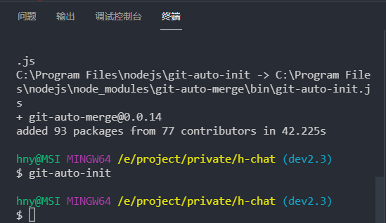
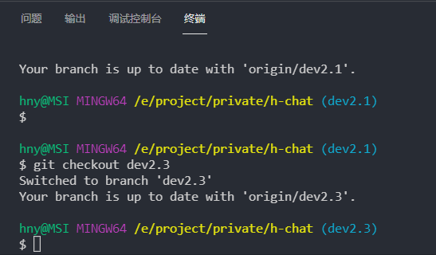

English | [中文文档](./README_zh.md)

## Example

### Code Push


### Code Merge


## Introduction
1. Execute commands to automatically push code to remote servers, no more manual add, commit, push; 
2. Execute the command to directly select the merge code to other branches and push it to the remote, automatically cutting back to the original branch

## Install
Can be installed locally or global: 

```bash
# yarn
yarn add git-auto-merge

# npm
npm install git-auto-merge
```

## Use
Code Push: `git-auto-push`

Code Merge: `git-auto-merge`

## Optional
### Add Command
Executing the initialization `git-auto-init` will automatically add the following to package.json for you.
```json
{
  "scripts": {
    "gp": "git-auto-push",
    "gm": "git-auto-merge"
  }
}
```

### Add Configuration
Create gm.config.js in the root of the project: 
```js
module.exports = {
  /** Mergeable branches, read all branches if not written by default */
  mergeBranch: [],

  /** Default merged branches */
  mergeDefault: [],

  /** Execute the callback after the merge is complete */
  callback: () => {},

  /** Log prefix */
  logPrefix: '',

  /** Default commit information */
  commitDefault: {
    type: 'feat',
    module: 'index',
    message: 'logic',
  },
}
```
